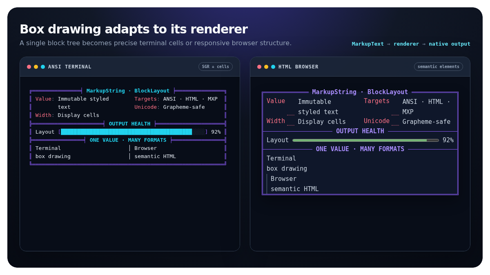
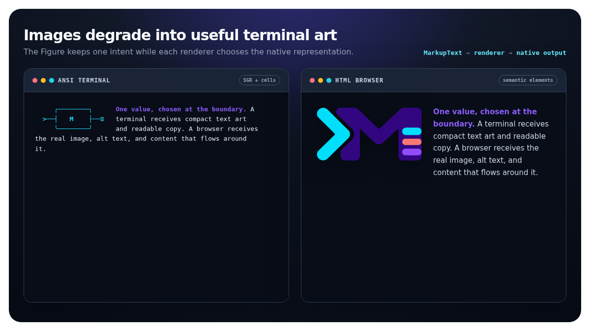

<p align="center">
  
</p>

<h1 align="center">MarkupString</h1>

<p align="center">
  <strong>Immutable, Unicode-aware styled text for terminals and the web.</strong><br>
  Build once. Preserve every layer. Render anywhere.
</p>

<p align="center">
  <a href="https://github.com/SharpMUSH/MarkupString/actions/workflows/ci.yml"></a>
  <a href="https://www.nuget.org/packages/MarkupString"></a>
  <a href="https://www.nuget.org/packages/MarkupString"></a>
  
  
  <a href="LICENSE"></a>
</p>

<p align="center">
  <a href="#quick-start">Quick start</a> ·
  <a href="#packages">Packages</a> ·
  <a href="#unicode-aware-layout">Layout</a> ·
  <a href="#documentation">Documentation</a> ·
  <a href="#contributing">Contributing</a>
</p>

---

`MarkupText` pairs a plain string with immutable, layered markup runs. The same value can render
as ANSI, HTML, Pueblo, MXP, BBCode, or plain text—and round-trip through JSON without discarding
markup a reader does not understand.

```text
                  ┌─ ANSI
                  ├─ HTML
plain text + runs ┼─ MXP / Pueblo
                  ├─ BBCode
                  └─ plain text
```

String operations preserve those runs. Layout uses terminal display cells, understands wide CJK,
combining marks, and emoji sequences, and never cuts a grapheme cluster in half.

## One value, native output

Choose the renderer at the boundary. The underlying `MarkupText` stays the same while each target
gets the representation it understands best.

### Box drawing becomes browser structure

The ANSI renderer emits exact terminal cells and SGR colour. The HTML renderer turns that same
block tree into responsive fieldsets, definitions, flex rows, rules, and meters.



### Images become useful terminal art

A `Figure` sends text art and flowing copy to a terminal, then becomes a real image with alt text
and naturally flowing content in HTML.



## Why MarkupString?

- **One source of truth** — keep content and semantics together, then choose the output format at
  the boundary.
- **Immutable values** — slicing, editing, wrapping, padding, and composition return new values
  while preserving markup.
- **Unicode-correct layout** — distinguish UTF-16 length, grapheme count, and terminal display
  width.
- **Extensible formats** — add an `IMarkup`, emitter, and codec through an explicit registry; no
  runtime discovery or reflection.
- **Streaming output** — render directly to an `IBufferWriter<char>` when allocating a string is
  unnecessary.
- **Native AOT ready** — every package is trimming-safe and free of reflection and dynamic code.

## Quick start

Install the core model and the markup kinds you need:

```sh
dotnet add package MarkupString
dotnet add package MarkupString.Ansi
```

Register those kinds once at startup, build a value, and render it explicitly:

```csharp
using MarkupString;
using MarkupString.Ansi;

MarkupRegistry.Default = MarkupRegistry.Empty.WithAnsi();

var greeting = MarkupText.Concat(
[
    MarkupText.Plain("Hello, "),
    MarkupText.Wrap(AnsiCodeParser.Parse("hr"), "world"),
    MarkupText.Plain("!")
]);

greeting.Render(MarkupFormat.Ansi);  // Hello, \e[1;31mworld\e[0m!
greeting.Render(MarkupFormat.Html);  // Hello, <span ...>world</span>!
greeting.Render(MarkupFormat.Plain); // Hello, world!
greeting.ToString();                 // Hello, world! — always plain text
```

Need a buffer instead of a new string?

```csharp
greeting.RenderTo(MarkupFormat.Ansi, bufferWriter);
```

See [Getting started](docs/getting-started.md) for registry lifetime, direct style construction,
parsing existing ANSI, and serialization.

## Packages

Choose only the markup kinds your application uses. The core package deliberately has no
rendering opinions.

| Package | Purpose |
|---|---|
| [`MarkupString`](https://www.nuget.org/packages/MarkupString) | `MarkupText`, runs, formats, registry and emitter contracts, JSON serialization, Unicode helpers, layout, and the shared sound/image/pane/gauge vocabulary. |
| [`MarkupString.Ansi`](https://www.nuget.org/packages/MarkupString.Ansi) | ANSI colours and attributes, links, code and escape-sequence parsers, multi-format emitters, and the matching HTML stylesheet. |
| [`MarkupString.Html`](https://www.nuget.org/packages/MarkupString.Html) | Checked raw HTML markup with configurable tag policies for trusted and untrusted input. |
| [`MarkupString.Mxp`](https://www.nuget.org/packages/MarkupString.Mxp) | The shared vocabulary expressed as client-supported MXP elements. |
| [`MarkupString.Pueblo`](https://www.nuget.org/packages/MarkupString.Pueblo) | The shared vocabulary expressed through Pueblo client extensions. |

```sh
dotnet add package MarkupString.Html
dotnet add package MarkupString.Mxp
dotnet add package MarkupString.Pueblo
```

All packages share one version and are released together.

## Unicode-aware layout

MarkupString keeps three measurements separate because they answer different questions:

| Measurement | Meaning | Example API |
|---|---|---|
| UTF-16 code units | Compatible with .NET string indexes and run offsets | `Length`, `Substring` |
| Grapheme clusters | User-perceived characters that must stay intact | `GraphemeCount`, `EnumerateGraphemes` |
| Display cells | Columns occupied in a terminal | `DisplayWidth`, `TruncateToWidth` |

That distinction powers grapheme-safe wrapping, truncation, padding, alignment, and multi-column
layouts:

```csharp
var format = new ColumnFormat
{
    Width = 24,
    Wrap = WrapMode.Word,
    Alignment = Alignment.Paragraph
};

var rows = TextLayout.Rows(
[
    new LayoutColumn(left, format),
    new LayoutSeparator(MarkupText.Plain("  │  ")),
    new LayoutColumn(right, format)
], new LayoutOptions());
```

Read [Text operations](docs/text-operations.md) for slicing and grapheme rules, then
[Layout](docs/layout.md) for wrapping, justification, fills, and column assembly.

## Design

MarkupString stores text as a `string` and markup as coalesced, non-overlapping runs. Each run owns
an ordered stack of layers; a slice clips the run array instead of rebuilding a markup tree.

Emitters are registered explicitly by `(markup type, format)`. ANSI output writes only the
difference between adjacent styles, while unknown serialized markup remains available for a
future reader that understands it.

The result is a small model with predictable composition, format-independent operations, and no
reflection hidden behind convenience APIs.

## Documentation

| Guide | Covers |
|---|---|
| [Getting started](docs/getting-started.md) | Installation, registry setup, building, rendering, parsing, and storage. |
| [Text operations](docs/text-operations.md) | Slicing, editing, searching, padding, alignment, and Unicode measurement. |
| [Layout](docs/layout.md) | Wrapping, justification, patterned fills, and multi-column rows. |
| [Formats and rendering](docs/formats.md) | Built-in formats, shared vocabulary, framers, untrusted tags, and custom formats. |
| [Custom markup kinds](docs/custom-markup.md) | Implementing an `IMarkup`, emitter, and codec. |
| [Serialization](docs/serialization.md) | JSON wire format, forward compatibility, and `UnknownMarkup`. |
| [Releasing](docs/releasing.md) | Versioning and publishing for maintainers. |

## Requirements

- .NET 10 or later
- Any runtime supported by .NET, including Native AOT deployments

## Contributing

```sh
dotnet build MarkupString.slnx
dotnet run --project MarkupString.Tests
```

The build enforces the repository's formatting rules and public API compatibility. Versions follow
[Semantic Versioning](https://semver.org/) through [MinVer](https://github.com/adamralph/minver): a
`v1.2.3` tag builds `1.2.3`; other commits produce preview versions.

## License

[Apache-2.0](LICENSE). MarkupString was extracted from and is used by
[SharpMUSH](https://github.com/SharpMUSH/SharpMUSH).
